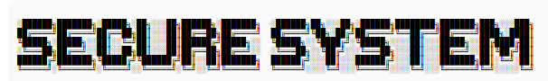

# Python-project🔗

<p align="center">
  
</p>

## Code xample 1

```
nama = input("masukan nama kamu: ")
id = int(input("masukan id kamu: "))
levelAkses = input("masukan level akses kamu: ")

print(f"[SYSTEM]: user '{nama}' dengan id {id} telah terdaftar sebagai {levelAkses}.")

```

---

## Code xample 2

### penambahan logika if else

```
nama = input("masukan nama kamu: ")
id = int(input("masukan id kamu: "))
levelAkses = input("masukan level akses kamu: ")

if id == 1111:
    print(f"[SYSTEM]: user '{nama}' dengan id {id} telah terdaftar sebagai {levelAkses}.")

else :
    print(f"[PERINGATAN]: id {id} tidak dikenal, akses diblokir")

```

---

## Code xample 3

### meningkatkan sistem anti brute force

```
nama = input("masukan nama kamu: ")
levelAkses = input("masukan level akses kamu: ")

kesempatan = 3
while kesempatan > 0:
    id = int(input("masukan id kamu: "))

    if id == 1111:
        print(f"[SYSTEM]: user '{nama}' dengan id {id} terdaftar sebagai {levelAkses}:")
        break
    else:
        kesempatan -= 1
        print(f"[PERINGATAN]: kesempatan kamu tinggal {kesempatan}")

        if kesempatan == 0:
            print(f"[PERINGATAN]: terlalu banyak percobaan, sistem anda terkunci")

```

---

## Code xample 4

## Menambahkan Daftar id sah

```
nama = input("masukan nama kamu: ")
levelAkses = input("masukan level akses kamu: ")

kesempatan = 3
daftar_id_sah = [1111, 2222, 3333]
while kesempatan > 0:
    id = int(input("masukan id kamu: "))

    if id in daftar_id_sah:
        print(f"[SYSTEM]: user '{nama}' dengan id {id} terdaftar sebagai {levelAkses}, login sukses! saat ini ada {len(daftar_id_sah)} user di database:")
        break
    else:
        kesempatan -= 1
        print(f"[PERINGATAN]: kesempatan kamu tinggal {kesempatan}")

        if kesempatan == 0:
            print(f"[PERINGATAN]: terlalu banyak percobaan, sistem anda terkunci")

```

---

## Code xample 5

### Penambahan fungsi def()

```
def registrasi_user ():
    print("---FORM REGISTRASI---")
    nama = input("masukan nama kamu: ")
    levelAkses = input("masukan level akses kamu: ")
    alamat = input("alamat kamu: ")
    return nama, levelAkses, alamat

def sistem_login (nama_pendaftar, level_pendaftar, alamat_pendaftar):
    print("/n---FORM LOGIN---")
    kesempatan = 3
    daftar_id_sah = [1111, 2222, 3333]
    while kesempatan > 0:
        id = int(input("masukan id kamu: "))

        if id in daftar_id_sah:
            print(f"[SYSTEM]: user '{nama_pendaftar}' dengan id {id} terdaftar sebagai {level_pendaftar}, alamat {alamat_pendaftar}, login sukses! saat ini ada {len(daftar_id_sah)} user di database:")
            break
        else:
            kesempatan -= 1
            print(f"[PERINGATAN]: kesempatan kamu tinggal {kesempatan}")

            if kesempatan == 0:
                print(f"[PERINGATAN]: terlalu banyak percobaan, sistem anda terkunci")

user_baru, level_baru, alamat_baru = registrasi_user()
sistem_login(user_baru, level_baru, alamat_baru)

```

---

## Code Xample 6

### memasangkan id dan user dalam database menggunakan dictionary

```

db_user = {
    1111 : "ipan",
    2222 : "anon",
    3333 : "ghostbyte"
    }

def sistem_login (database):
    print("/n---FORM LOGIN---")
    kesempatan = 3
    while kesempatan > 0:
        id = int(input("masukan id kamu: "))

        if id in db_user:
            nama_ditemukan = database[id]
            print(f"[SYSTEM]: halo {nama_ditemukan} ")
            break
        else:
            kesempatan -= 1
            print(f"[PERINGATAN]: kesempatan kamu tinggal {kesempatan}")

            if kesempatan == 0:
                print(f"[PERINGATAN]: terlalu banyak percobaan, sistem anda terkunci")

sistem_login(db_user)

```

---
